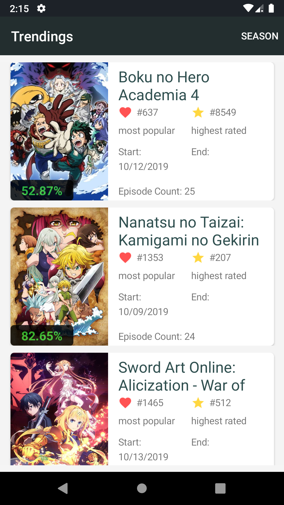
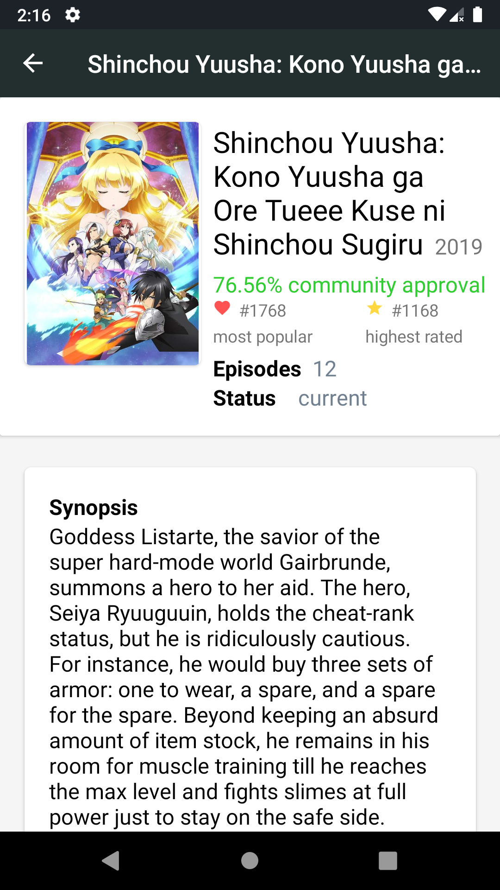

# Anime Trending App

App that fetch kitsu api to display the top 10 most popular animes of all time and of the season

# Why?
This app is part of my personal portfolio, so i will be glad for any feedback. \
You can contact me in this email: fernandovmp@outlook.com

# Getting started
## Requiriments
Require Visual Studio and Xamarin installed to open this project.

## Installation
Clone this repository:
`$ git clone https://github.com/fernandovmp/anime-trending-app.git` \
Open the `AnimeTrendingApp.sln` file, that can be found in the root of project, with the Visual Studio.

# Technical overview
This app are made with the following technologies:
- [Xamarin.Forms](https://github.com/xamarin/Xamarin.Forms) : UI Framework to Xamarin
- [Kitsu API](https://github.com/hummingbird-me/api-docs) : Api that provide the data
- [DryIoc](github.com/dadhi/DryIoc) : A dependency injection conteiner

# Contribute
To contribute fork this repository, create a new branch and after make the changes do a pull request. Any contribution is wellcome.

Open an issue if you find a bug or think that are something wrong.

The code style is the same as [.NET Foundation](https://github.com/dotnet/corefx/blob/master/Documentation/coding-guidelines/coding-style.md)
